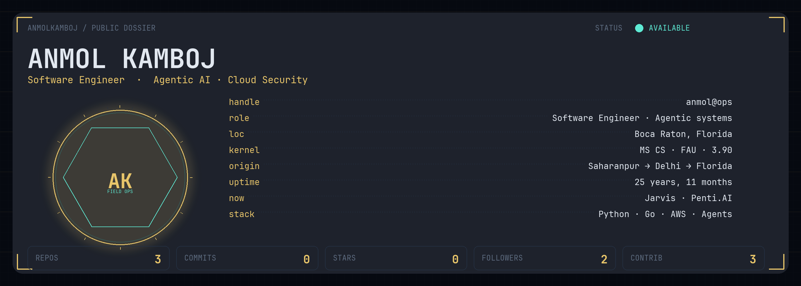

  

  

  

  <a href="https://portfolio-nine-lovat-52.vercel.app/"><b>Portfolio</b></a>
  &nbsp;·&nbsp;
  <a href="https://www.linkedin.com/in/anm0lkamb0j">LinkedIn</a>
  &nbsp;·&nbsp;
  <a href="mailto:anmolkamboj@gmail.com">Email</a>
  &nbsp;·&nbsp;
  <a href="https://github.com/AnmolKamboj">GitHub</a>

I am a software engineer in Boca Raton. I build **agentic systems** and the **cloud security** around them — the kind of software that can take a multi-step job, keep context, and still be inspectable when something goes wrong.

The through-line is practical: a clean interface on the front, orchestration and AWS behind it, and an agent only when a dashboard is not enough.

---

## Now

**Jarvis** — a Telegram-native personal agent. One persistent interface that already knows the work, instead of a new chat that needs the same briefing every hour.

**Penti.AI** — agentic penetration testing in production. Recon that maps the real surface, scanning with context, validation before the victory lap, reports people can use.

---

## Selected work

| Where | What I actually built |
| --- | --- |
| [Penti.AI](https://portfolio-nine-lovat-52.vercel.app/) · Agentic AI & Full Stack · Jun 2025 – present | Multi-step agent workflows for automated reconnaissance, vulnerability scanning, exploitation logic, and reporting. Python, Tailwind, AWS. |
| [FourKites](https://www.fourkites.com/) · Software Engineer · Aug 2022 – May 2023 | Appointment Manager for carrier pickup and drop-off tracking. Go, Python, HTML. Cut performance time ~15%, shipped 10+ UI features, automated 50 existing flows. |
| Jarvis · building | Personal agent inside Telegram with memory that survives the next conversation. Deployed on Railway. |

---

## Education

- **M.S. Computer Science**, Florida Atlantic University — May 2026 · GPA 3.90 / 4.0
- **B.E. Computer Science (Gaming & Graphics)**, Chandigarh University — June 2023

Saharanpur → New Delhi → Florida. Right-handed, left-handed batsman. I like systems that look quiet until the last move.

---

## Stack I actually reach for

| Layer | Tools |
| --- | --- |
| Interface | React, Next.js, TypeScript, Tailwind |
| Systems | Python, Go, SQL, Flask, REST |
| Cloud | AWS, Docker, CI/CD, IAM, GCP |
| Agents | LLM tooling, orchestration, tool calling |

---

## Contribution theater

The green squares become a shooting gallery. This file refreshes from GitHub Actions using [gh-space-shooter](https://github.com/czl9707/gh-space-shooter) — the same engine as the arcade GIFs making the rounds on profiles.

  

---

## Tactical layer

An original animation of the Opera Game (Morphy, 1858). Morphy gives material away on purpose, then ends it on the back rank. That is the instinct I want in agent workflows and cloud security: less noise, one clean finishing line.

  

---

  Custom dossier. No paid profile skin. Header stats refresh daily.

