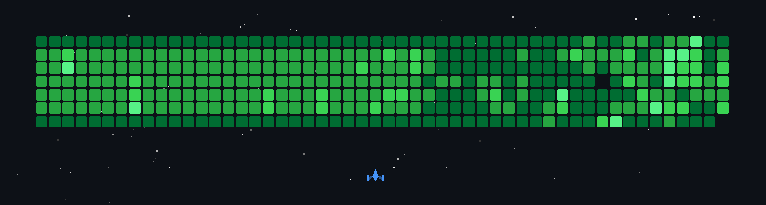
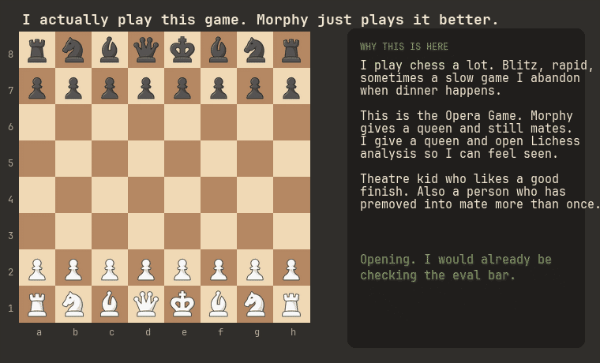

  

# Hi there, I'm **Anmol Kamboj**

Software engineer in Boca Raton. I build agentic security systems, cloud-backed software, and interfaces that do not waste your time. Built to make things work. Curious enough to break them too.

> [!WARNING]
> I play a lot of chess. If this page starts talking about hanging queens, that is not a metaphor. That is my Tuesday.

I like clean interfaces, but I also like knowing what happens after the button gets clicked. React and Tailwind on the front. Python, Go, and AWS behind it. Agents when a dashboard is not enough.

Dehradun to Florida. Still translating weather, measurements, and small talk. Quiet by default. If something is interesting, it gets free rent in my head.

## Work

- [**Penti.AI**](https://portfolio-nine-lovat-52.vercel.app/) (Jun 2025 to present) - Agentic AI and full stack. Recon, scanning with context, validation before anyone calls it a win, reports people can actually use. Python, Tailwind, AWS.
- [**FourKites**](https://www.fourkites.com/) (Aug 2022 to May 2023) - Appointment Manager for carrier pickup and drop-off. Go, Python, HTML. Cut the slow path by about 15%, shipped a pile of UI, automated 50 existing flows.

## School

- M.S. Computer Science, Florida Atlantic University, May 2026. GPA 3.90.
- B.E. Computer Science (Gaming and Graphics), Chandigarh University, 2023.

Former theatre kid. I used to act, dance, mimic people, and tell bad jokes on stage. Now I do a version of that with pull requests. Chess, The Witcher 3, and RDR2 keep the sleep schedule honest. GTA VI is the official reason a PS5 will eventually exist. Grass contact: still unverified.

## The stack I reach for

React, Next.js, TypeScript, Tailwind, HTML, CSS. Python, Go, SQL, Flask, REST. AWS, Docker, CI/CD, IAM, GCP. LLM tooling and agent orchestration when the job is more than another admin panel.

## GitHub activity

This is my contribution graph playing space invaders. Same engine [asamassekou10](https://github.com/asamassekou10) used. The squares are real weeks. The ship is coping.

  

## Chess, because I actually play

I did not put a board here to look clever. I put it here because I lose games at 1am and then think about them in the shower. The clip is the Opera Game. Morphy sacrifices a queen and mates. I sacrifice a queen and open the analysis board so I can say "yeah I saw that" to nobody.

  

If you want a game, send a Lichess challenge. I will accept, play too fast, and blame the time control.

## Connect

- [Portfolio](https://portfolio-nine-lovat-52.vercel.app/)
- [LinkedIn](https://www.linkedin.com/in/anm0lkamb0j)
- [Instagram](https://www.instagram.com/anm0l_kamb0j/)
- [X](https://x.com/Anm0lKamb0j)
- [Email](mailto:anmolkamboj@gmail.com)
- [GitHub](https://github.com/AnmolKamboj)
