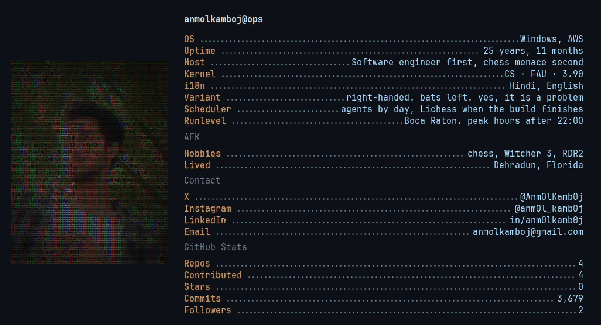
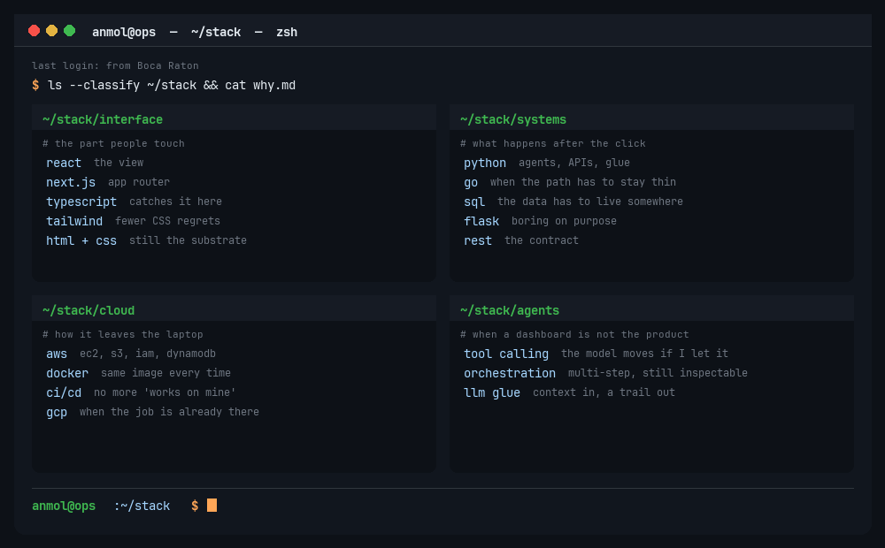

  

# Hi there, I'm **Anmol Kamboj**

Software engineer in Boca Raton. I work on agentic security systems and the cloud they run on.

Dehradun to Florida. MS in Computer Science at FAU. I take a multi-step job, keep the context, and leave a trail you can inspect when something breaks.

## Work

- [**Penti.AI**](https://portfolio-nine-lovat-52.vercel.app/) (Jun 2025 to present). Agentic AI and full stack. Recon, scanning with context, validation before anyone calls it a win, reports people can use. Python, Tailwind, AWS.
- [**FourKites**](https://www.fourkites.com/) (Aug 2022 to May 2023). Appointment Manager for carrier pickup and drop-off. Go, Python, HTML. Cut the slow path by about 15 percent, shipped new UI, automated 50 existing flows.

## School

- M.S. Computer Science, Florida Atlantic University, May 2026. GPA 3.90.
- B.E. Computer Science (Gaming and Graphics), Chandigarh University, 2023.

## The stack I reach for

Not a badge wall. Four folders I actually open when the work starts.

  

Frontend is for the part people touch. Python and Go are for the part that has to finish. AWS is how it leaves my laptop. Agents show up when a dashboard would just be a prettier way to do the same job by hand.

## GitHub activity

My contribution graph, except a ship is allowed to shoot it. The squares are real weeks.

  

## Chess

I put a board here because I play. Blitz, rapid, the occasional slow game I abandon when dinner happens. The clip is Morphy's Opera Game. He gives a queen and still mates. I give a queen and open the analysis board.

  

If you want a game, send a Lichess challenge. I will accept, play too fast, and blame the clock.

## Connect

- [Portfolio](https://portfolio-nine-lovat-52.vercel.app/)
- [LinkedIn](https://www.linkedin.com/in/anm0lkamb0j)
- [Instagram](https://www.instagram.com/anm0l_kamb0j/)
- [X](https://x.com/Anm0lKamb0j)
- [Email](mailto:anmolkamboj@gmail.com)
- [GitHub](https://github.com/AnmolKamboj)
